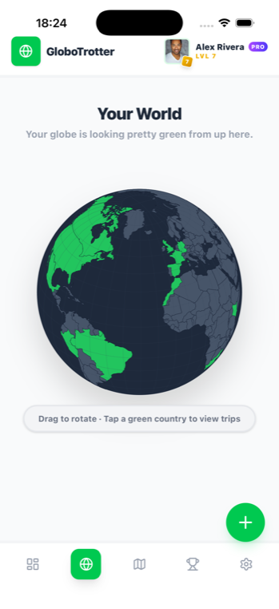
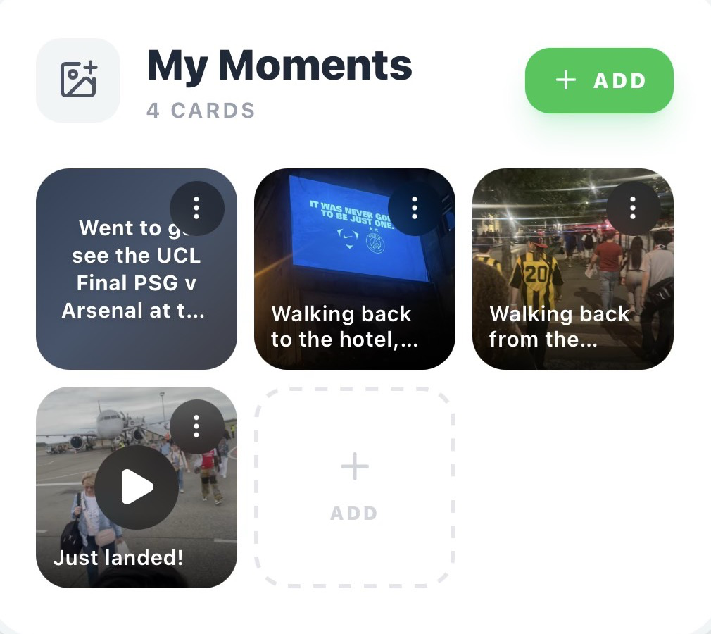
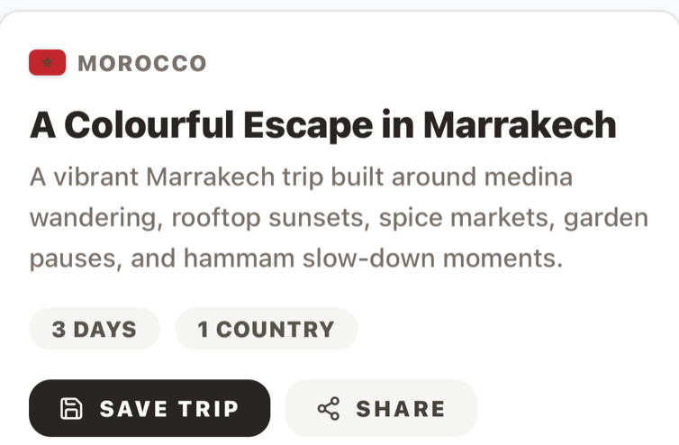
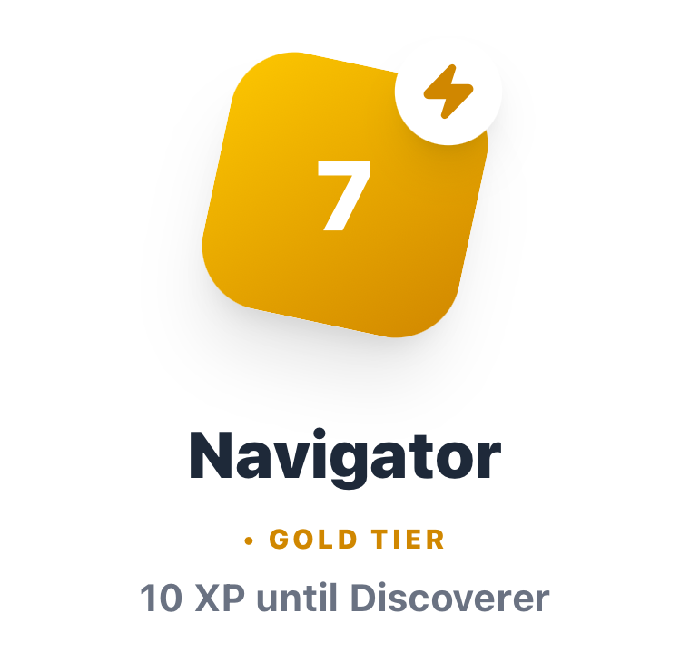

<div align="center">

# GloboTrotter

### A commissioned travel product engagement for Glenmont Circle

**Interactive travel history, AI itinerary planning, journaling, and rewards—designed and delivered across web and iOS.**

[](https://u-kaushik.github.io/GloboTrotter-portfolio/)
[](https://react.dev)
[](https://www.typescriptlang.org)

</div>


## Project context

Glenmont Circle commissioned GloboTrotter from an initial travel-product brief through a production web application and iOS distribution path. I worked as the independent product designer and engineer responsible for the end-to-end delivery: product definition, brand and interaction design, front-end architecture, data visualisation, AI workflows, backend integration, monetisation, analytics, mobile packaging, and launch presentation.

The studio brief was to create a travel product that became more personal over time. Rather than producing another generic booking or itinerary interface, I designed the experience around a user's own travel history: a globe that fills in as they explore, a journal that preserves memories, and planning tools informed by where they have already been.

> **[Explore the recruiter-safe live demo →](https://u-kaushik.github.io/GloboTrotter-portfolio/)**

## My contribution

- Took the commissioned brief from product definition through a production-ready web and iOS experience.
- Designed the product identity, responsive design system, onboarding, dashboard, interactive globe, journal, planner, Time Capsule, rewards, and upgrade flows.
- Built the React and TypeScript application, including component architecture, client state, responsive behaviour, motion, and accessibility considerations.
- Implemented the D3 and TopoJSON travel globe with touch-safe mobile interaction.
- Designed secure server boundaries for AI itinerary and nostalgia features, keeping provider credentials and paid actions off the client.
- Integrated Firebase, analytics, Stripe, and the Capacitor-based iOS distribution path.
- Produced the portfolio-safe demo, launch assets, product presentation, and technical documentation.

## Product experience

| Personal globe | Travel journal |
| --- | --- |
|  |  |
| **AI-assisted planning** | **Progress and rewards** |
|  |  |

## Product decisions

### Make travel history the input

Most travel-planning tools begin with an empty prompt. GloboTrotter begins with the user's own map, memories, preferences, and previous journeys, giving future recommendations useful personal context.

### Translate AI infrastructure into product language

The interface uses “fuel” rather than tokens or credits, and presents a planner rather than a generic generator. Paid AI actions remain understandable without exposing implementation vocabulary.

### Combine utility with emotional recall

The globe, journal, and Time Capsule give completed trips ongoing value. Planning and memory are connected parts of one experience instead of separate tools.

### Design once for web and iOS

Responsive interaction, safe-area behaviour, touch handling, and Capacitor packaging were considered as part of the product system rather than added after the desktop application.

## Engineering highlights

- React 19 and TypeScript component architecture with a Vite build pipeline.
- D3 and TopoJSON interactive globe with mobile drag and country-state visualisation.
- Firebase authentication, Firestore persistence, and photo storage in the production architecture.
- Server-side Anthropic workflows for itinerary and Time Capsule generation.
- Stripe monetisation on web with RevenueCat and Capacitor integration points for iOS.
- Mixpanel and GA4 product analytics across onboarding, engagement, planning, and conversion.
- Motion-led onboarding, guided walkthroughs, rewards, and celebration states.
- Recruiter-safe static mode using realistic local data and no production credentials.

## Architecture

```text
React product UI
├── D3 / TopoJSON globe
├── journal, planner, rewards, and onboarding state
├── Firebase auth, database, and storage clients
└── serverless boundary
    ├── AI itinerary and Time Capsule workflows
    ├── fuel accounting and abuse protection
    ├── Stripe checkout and webhooks
    └── analytics and share metadata

Capacitor shell → iOS distribution and RevenueCat integration path
```

The public repository intentionally replaces production services with safe placeholders while retaining the real interface, component structure, interaction patterns, and representative data.

## Technology

| Area | Technology |
| --- | --- |
| Product UI | React 19, TypeScript 5.8, Tailwind CSS 4 |
| Visualisation | D3 v7, TopoJSON |
| Motion | Motion |
| Production data | Firebase Auth, Firestore, Storage |
| AI boundary | Anthropic via serverless functions |
| Monetisation | Stripe; RevenueCat integration path for iOS |
| Analytics | Mixpanel, Google Analytics 4 |
| Mobile | Capacitor iOS |
| Portfolio deployment | GitHub Pages |

## Run the portfolio build

```bash
git clone https://github.com/u-kaushik/GloboTrotter-portfolio.git
cd GloboTrotter-portfolio
npm install
npm run dev
```

Useful checks:

```bash
npm run lint
npm run build
```

This public build starts in demo mode with representative local data. Production authentication, payment credentials, AI proxy implementation, private operations material, and environment secrets are intentionally omitted.

## Repository map

```text
src/
├── components/   # Product screens and composed experiences
├── constants/    # Gamification and onboarding definitions
├── data/         # Portfolio-safe discovery and demo content
├── lib/          # Travel-domain and demo-mode helpers
├── services/     # Client-side analytics and AI interfaces
├── App.tsx       # Application orchestration
└── main.tsx      # Recruiter-safe demo bootstrap
```

## Portfolio and ownership

This repository presents work delivered for Glenmont Circle and is published for portfolio review. I was responsible for the end-to-end product and technical execution described above; the original opportunity and commercial brief came from the commissioning studio.

## License

Proprietary portfolio material. All rights reserved.
