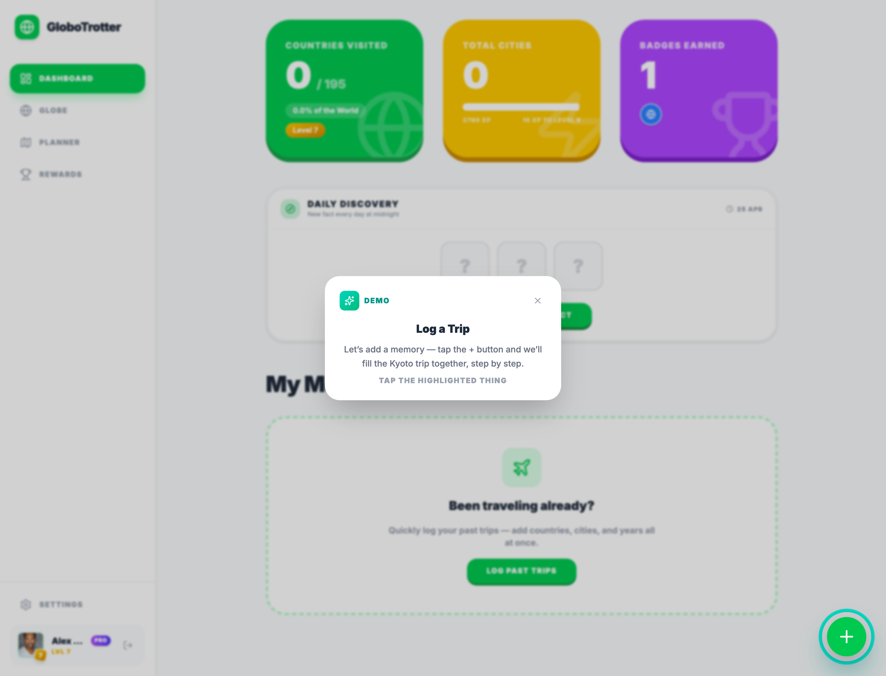

<div align="center">

# GloboTrotter Portfolio Demo

**A static portfolio demo of the GloboTrotter travel app UI**

[](https://u-kaushik.github.io/GloboTrotter-portfolio/)
[](https://react.dev)
[](https://www.typescriptlang.org)
[](https://vitejs.dev)
[](https://tailwindcss.com)

</div>

---

## Overview

This repository is a public, recruiter-friendly portfolio version of GloboTrotter. It preserves the real product UI, interaction patterns, and front-end architecture, while removing production services and sensitive implementation details.

The goal is simple: show the polish, product thinking, and technical execution of the app without exposing live auth, private backend logic, payments, or environment secrets.

> **[Try the live demo →](https://u-kaushik.github.io/GloboTrotter-portfolio/)**

<div align="center">
  
</div>

---

## Key Features

### Real Product UI
This build uses the actual GloboTrotter interface rather than a simplified mock. It demonstrates the interactive globe, travel journal views, onboarding flow, itinerary planner UI, rewards system, and guided product walkthrough.

### Recruiter-Friendly Demo Mode
The app boots directly into a static walkthrough with local dummy data. That makes it easy to assess the product without requiring login, setup, or backend access.

### Guided Portfolio Experience
A guided tour is enabled by default so recruiters and hiring managers can move through the product intentionally rather than landing in an empty shell.

### Portfolio-Safe Extraction
Private infrastructure is removed or stubbed. This keeps the public repo safe to share while still showing a realistic front-end codebase and product flow.

### Public Portfolio Build
The portfolio build remains a safe static showcase for GitHub and CV links, with a stable GitHub Pages deployment for recruiter-friendly review.

---

## What Is Included

- Real GloboTrotter React + TypeScript UI
- Static demo mode with local sample travel data
- Guided walkthrough behaviour for portfolio review
- Travel globe, journal, planner, rewards, and onboarding screens
- GitHub Pages deployment workflow

## What Is Intentionally Omitted

- Live Firebase auth and production persistence
- Serverless AI proxy implementation
- Stripe / RevenueCat production payment flows
- Private environment variables and service credentials
- Internal roadmap, ops notes, and product documentation
- Production mobile packaging and release configuration

---

## Tech Stack

| Layer | Technology |
|---|---|
| **Framework** | React 19, TypeScript 5.8 |
| **Build** | Vite 6 |
| **Styling** | Tailwind CSS 4 |
| **Visualisation** | D3, TopoJSON |
| **Animation** | Motion |
| **Icons** | Lucide React |
| **Client Services** | Firebase SDK, Mixpanel |
| **Deploy** | GitHub Pages |

---

## Getting Started

### Prerequisites

- [Node.js](https://nodejs.org/) (v18+)

### Installation

```bash
# Clone the repository
git clone https://github.com/u-kaushik/GloboTrotter-portfolio.git
cd GloboTrotter-portfolio

# Install dependencies
npm install

# Start the dev server
npm run dev
```

The app will be available at **http://localhost:5173** by default.

> **Note:** This portfolio repo is designed to work as a static demo. Production auth, AI, and payment functionality are intentionally not part of this public build.

---

## Project Structure

```text
├── index.html              # HTML entry point
├── package.json            # Scripts and dependencies
├── vite.config.ts          # Vite configuration
├── public/                 # Static assets, icons, OG image, demo SVGs
├── src/
│   ├── App.tsx             # Root app shell
│   ├── main.tsx            # Demo-mode bootstrap
│   ├── firebase.ts         # Portfolio-safe Firebase placeholder config
│   ├── types.ts            # Shared TypeScript interfaces
│   ├── components/         # Product UI components
│   ├── constants/          # Static product constants
│   ├── data/               # Demo discovery data
│   ├── lib/                # Utility helpers
│   └── services/           # Analytics and AI client wrappers
└── .github/workflows/
    └── deploy.yml          # GitHub Pages deploy workflow
```

---

## Demo Architecture Notes

### Demo Bootstrapping
`src/main.tsx` forces a recruiter-safe experience by enabling demo mode through local storage before the app mounts.

### Static Front-End Focus
This repo is intentionally front-end heavy. It is meant to show interface quality, component composition, state flow, and product UX rather than expose private infrastructure.

### Safe Public Sharing
If you see placeholder Firebase values or disabled backend pathways, those are deliberate guardrails for a public portfolio repository.

---

## Live Demo

**[https://u-kaushik.github.io/GloboTrotter-portfolio/](https://u-kaushik.github.io/GloboTrotter-portfolio/)**

The demo opens directly into a static portfolio walkthrough with dummy travel data and recruiter-friendly navigation.

---

## License

This project is proprietary. All rights reserved.
